# Mission Planner

The Mission Planner module generates a reference trajectory/path in a local road model based on mission inputs. These inputs are received from the Human Machine Interface (HMI) or another agent. The resulting trajectory or path is then forwarded to the Behavior Planner for further processing.

The Mission Planner requires a local road model (RoadSegments). For example, this environment model can be provided by the driveblocks GmbH (<https://www.driveblocks.ai/>).

The RoadSegments message contains multiple segments, each characterized by the following components:

- Linestrings: Two distinct linestrings that define the geometry of the segment.
- Neighbor IDs: Identifiers for neighboring segments.
- Successor IDs: Identifiers for successor segments.

Additionally, the RoadSegments message includes a pose attribute, which provides the position and orientation of the ego vehicle relative to the road segments. This structure allows for a comprehensive representation of road segments and their spatial relationships.

A detailed overview can be seen here:



## Components

The Mission Planner consists of several components (ROS2 packages) working together:

- **Local Mission Planner**: Generates target lanes based on the mission input.
- **HMI (Human Machine Interface)**: Provides a user interface for defining missions via terminal input.
- **Converter**: Converts lanes generated by the Mission Planner into Autoware Trajectories/Paths.
- **Local Map Provider**: Converts the RoadSegments message into a LocalMap message.
- **Library**: Contains shared code.

## Launching the Software

To launch all nodes of the software:

```bash
ros2 launch autoware_local_mission_planner mission_planner_compose.launch.py
```

To launch a specific node, such as the mission planner:

```bash
ros2 launch autoware_local_mission_planner mission_planner.launch.py
```

## Additional Notes

During the beta phase, the mission planner will immediately output a straight trajectory with low velocity to move the vehicle into the local road model. Once the vehicle can be located in the local road model, a trajectory following the ego lane will be computed.
